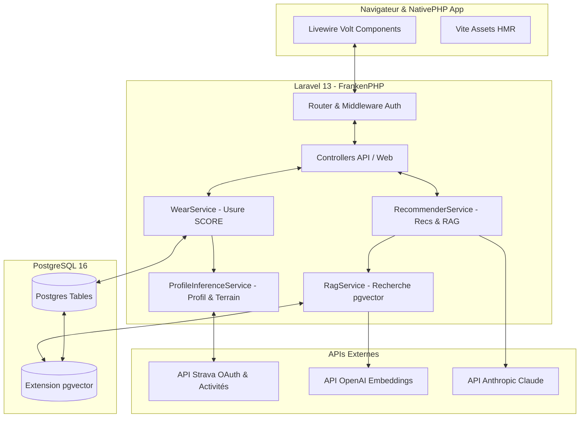
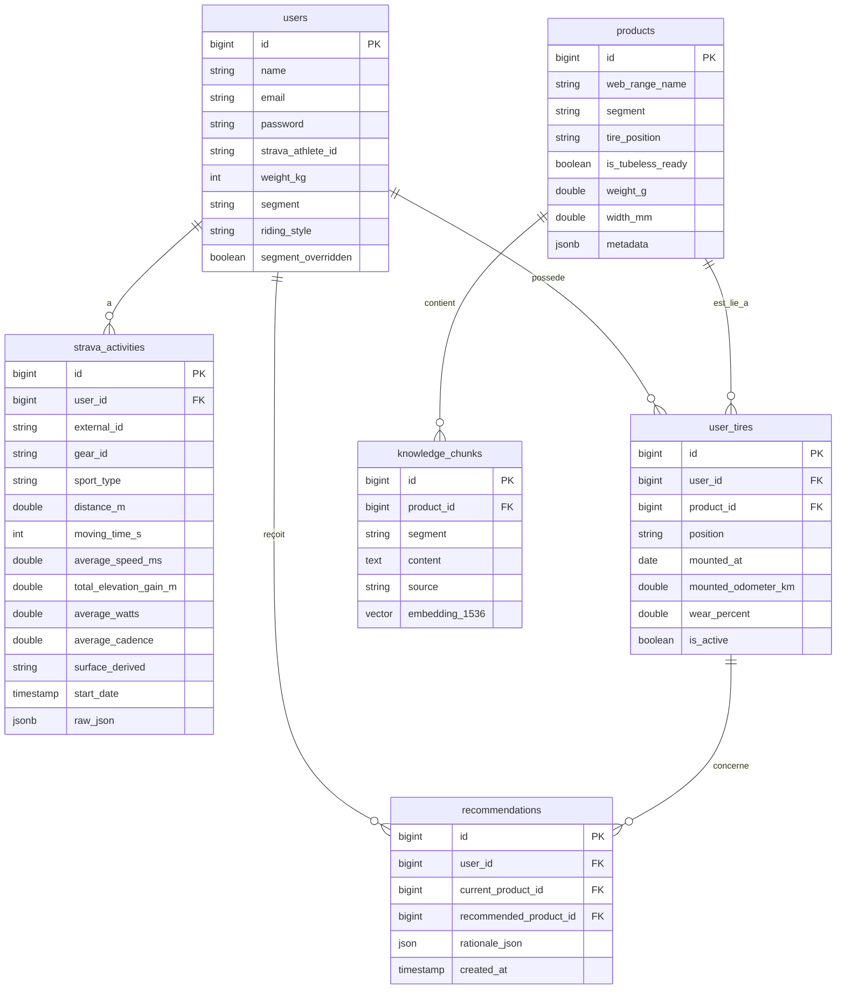
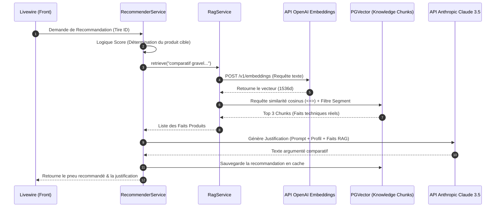

# Architecture Technique de l'Application

Ce document présente l'architecture globale de **RideReady**, le modèle de données, les algorithmes clés et le pipeline d'intelligence artificielle (RAG + LLM).

---

## 🏗️ Vue d'Ensemble du Système

L'application suit une architecture monolithique modulaire sous **Laravel 13**, tirant parti de **Livewire Volt** (Single File Components) pour l'interface réactive et de **FrankenPHP** (ou Laravel Herd en local) pour le serveur d'application.

---

## 📊 Modèle de Données et Relations

L'application utilise PostgreSQL. L'extension `pgvector` est activée pour gérer le stockage et la recherche des vecteurs à 1536 dimensions.

---

## ⚡ Algorithmes Clés

### 1. Détection Automatique de Surface (`ProfileInferenceService`)
L'API Strava ne fournit pas de type de surface (goudron, terre, etc.). Le service [ProfileInferenceService](file:///C:/Users/Guillaume/PhpstormProjects/michelin/app/Services/ProfileInferenceService.php) analyse les signaux physiques de chaque sortie pour déduire le terrain dominant :

* **Ride & VirtualRide** : Directement classés en `Asphalt` (Route).
* **GravelRide** :
  * Dénivelé $\le 8\text{ m/km}$ et vitesse $> 24\text{ km/h}$ $\rightarrow$ `Asphalt` (Randonnée roulante type route).
  * Dénivelé $\le 14\text{ m/km}$ $\rightarrow$ `Hardpacked` (Chemin sec/damé).
  * Sinon $\rightarrow$ `Mixed` (Chemin caillouteux/technique).
* **MountainBikeRide & EMountainBikeRide** :
  * Dénivelé $\le 15\text{ m/km}$ $\rightarrow$ `Mixed`.
  * Vitesse moyenne $< 12\text{ km/h}$ $\rightarrow$ `Mud` (Single-track très technique/boueux).
  * Dénivelé $\le 30\text{ m/km}$ $\rightarrow$ `Soft` (Terre meuble).
  * Sinon $\rightarrow$ `Mud` (Terrain difficile).

---

### 2. Formule de Calcul de l'Usure (`WearService` &mdash; SCORE)
L'usure n'est pas calculée sur les simples kilomètres réels, mais convertie en **kilomètres équivalents** accumulés selon la sévérité de l'usage. La formule SCORE est appliquée par activité depuis la date de montage (`mounted_at`) :

$$\text{Usure Activité (km équivalents)} = \text{Distance (km)} \times \text{Coeff Terrain} \times \text{Coeff Poids} \times \text{Coeff Style}$$

* **Coeff Poids** (borné entre $0.85$ et $1.30$) :
  $$\text{Coeff Poids} = 1 + \frac{\text{Poids (kg)} - 80}{100}$$
* **Coeff Style** (basé sur l'agressivité détectée) :
  * `ENDURANCE` : $1.00$
  * `MIXED` : $1.08$
  * `AGRESSIF` : $1.15$
* **Coeff Terrain** (dépendant du segment et du sol) :
  * Configuré dynamiquement dans la table `wear_coefficients`. Exemple pour le segment **Gravel** :
    * Asphalt : $0.90$ | Hardpacked : $1.10$ | Mixed : $1.25$ | Soft : $1.40$ | Mud : $1.80$
* **Calcul d'End of Life (EOL)** :
  * Le pourcentage d'usure final est : 
    $$\text{Usure (\%)} = \min\left(100.0, \frac{\sum \text{Usure Activité}}{\text{Baseline EOL (ex. 4000 km)}}\right) \times 100$$

---

## 🤖 Pipeline de Recommandation (RAG + LLM)

Lorsqu'un pneu atteint un seuil critique d'usure ($\ge 85\%$), le système déclenche une proposition de remplacement gérée par [RecommenderService](file:///C:/Users/Guillaume/PhpstormProjects/michelin/app/Services/RecommenderService.php) :

### Protection anti-hallucination :
1. **Filtre strict de segment** : La recherche vectorielle filtre uniquement sur les fiches produits correspondant au segment de l'utilisateur (Gravel, VTT, Route, etc.).
2. **Seuil de similarité cosinus** : Seuls les chunks avec une distance cosinus $< 0.25$ sont acceptés pour éviter d'injecter des données hors-sujet.
3. **Prompt directif** : Le LLM reçoit une consigne lui interdisant d'inventer des données techniques non présentes dans les chunks du catalogue officiel fournis en contexte.
