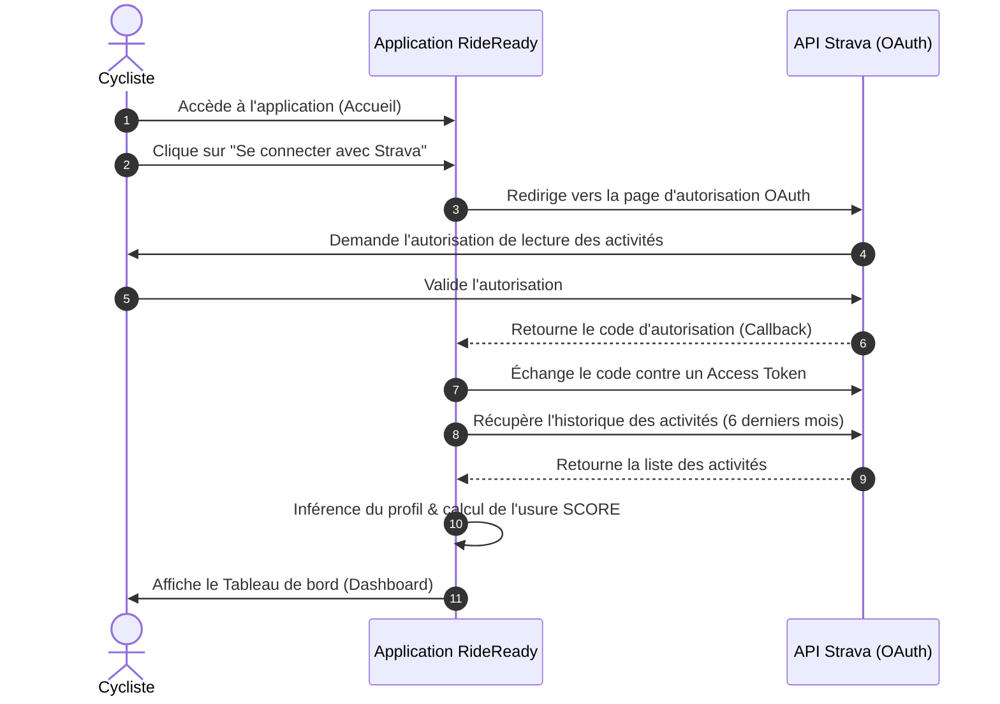
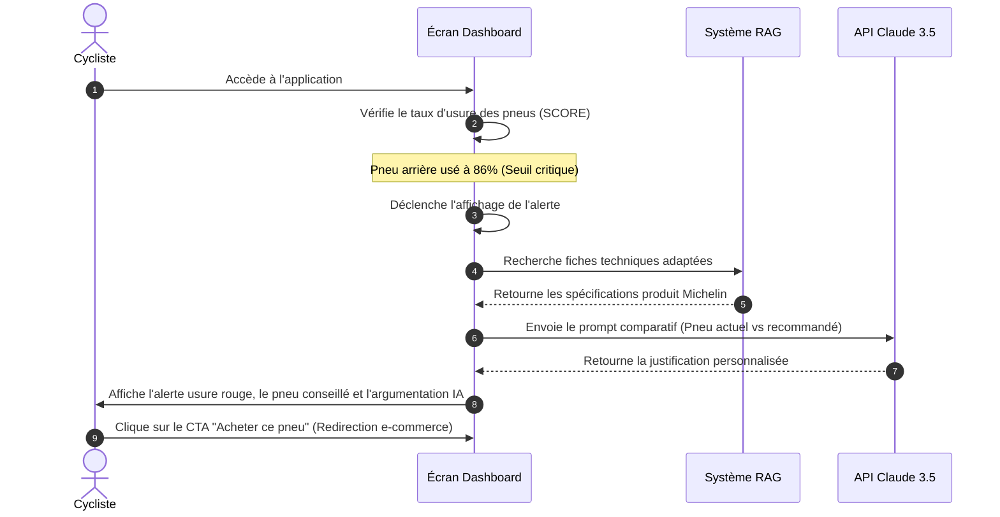

# Parcours Utilisateurs & Maquettes d'Interface

Ce document modélise l'expérience utilisateur (UX) de **RideReady** à travers des diagrammes de parcours et décrit la structure des écrans clés (wireframes).

---

## 🗺️ Parcours Utilisateurs (User Journeys)

### 1. Inscription et Synchronisation Strava
Ce parcours décrit les étapes franchies par un nouvel utilisateur pour charger ses données.



---

### 2. Consultation de l'Usure et Recommandation
Ce parcours montre comment l'utilisateur interagit avec l'application lorsqu'un pneu atteint sa limite d'usure.



---

## 🎨 Maquettes d'Interface (Wireframes Structurés)

L'application utilise le framework CSS **Tailwind v4** et le design system **Flux UI** pour offrir une interface moderne, sombre/claire et responsive.

### 1. Tableau de bord (`dashboard.blade.php`)
L'écran principal s'organise en deux colonnes principales :

```
+----------------------------------------------------------------------------------+
|  [Logo RideReady]   Mes Équipements     Mes Activités     Mon Profil      [Profil] |
+----------------------------------------------------------------------------------+
|                                                                                  |
|  📌 MES ÉQUIPEMENTS                                                             |
|  Suivi en temps réel de l'usure de vos pneus Michelin.                           |
|                                                                                  |
|  +--------------------------------+  +----------------------------------------+  |
|  | 🚴 PNEU ACTUEL MONTÉ           |  | 💡 RECOMMANDATION DE REMPLACEMENT      |  |
|  | Position : Arrière             |  | Pneu conseillé :                       |  |
|  | Produit : Michelin Power Gravel|  | -> MICHELIN POWER GRAVEL RS RACING LINE|  |
|  |                                |  |                                        |  |
|  | Usure calculée :               |  | Pourquoi ce choix ?                    |  |
|  | [█████████████████████░░░] 86% |  | "D'après vos sorties Strava (60%       |  |
|  | (Statut : CRITIQUE)            |  | route / 40% chemin), le Power Gravel   |  |
|  |                                |  | RS vous apportera un gain de 7 watts   |  |
|  | Distance restante estimée :    |  | tout en conservant une excellente      |  |
|  | **340 km**                     |  | protection contre les crevaisons..."   |  |
|  |                                |  |                                        |  |
|  | Dépassement kilométrage :      |  | Comparatif :                           |  |
|  | Pneu monté il y a 180 jours.   |  | +-------------+----------+-----------+ |  |
|  | Odomètre : 1 200 km réels.     |  | | Carac       | Actuel   | Proposé   | |  |
|  |                                |  | +-------------+----------+-----------+ |  |
|  |                                |  | | Poids       | 480g     | 410g      | |  |
|  |                                |  | | Tubeless    | Oui      | Oui       | |  |
|  |                                |  | +-------------+----------+-----------+ |  |
|  |                                |  |                                        |  |
|  |                                |  | [🛒 Commander ce pneu]                 |  |
|  +--------------------------------+  +----------------------------------------+  |
|                                                                                  |
+----------------------------------------------------------------------------------+
```

---

### 2. Liste des Activités (`⚡activities.blade.php`)
Affiche l'historique des sorties importées de Strava avec la détection de terrain effectuée par l'algorithme :

```
+----------------------------------------------------------------------------------+
|  📊 VOS SORTIES SYNCHRONISÉES (80 activités trouvées)                            |
|  Les activités ci-dessous servent à calculer l'usure de vos pneus.               |
|                                                                                  |
|  +----------------------------------------------------------------------------+  |
|  | Date        | Type       | Surface Détectée | Distance    | Dénivelé       |  |
|  |-------------|------------|------------------|-------------|----------------|  |
|  | 15 Juin 26  | GravelRide | [Hardpacked] (O) | 45.2 km     | 450 m          |  |
|  | 12 Juin 26  | GravelRide | [Asphalt] (V)    | 62.0 km     | 180 m          |  |
|  | 08 Juin 26  | GravelRide | [Mixed] (Jaune)  | 38.5 km     | 690 m          |  |
|  | 05 Juin 26  | MTB Ride   | [Mud] (Rouge)    | 24.1 km     | 820 m          |  |
|  +----------------------------------------------------------------------------+  |
|  | < Précédent                                                   Suivant >    |  |
|  +----------------------------------------------------------------------------+  |
+----------------------------------------------------------------------------------+
```

---

### 3. Profil et Préférences (`⚡profile.blade.php`)
Affiche les paramètres physiques du cycliste et le profil de pratique inféré par l'application :

```
+----------------------------------------------------------------------------------+
|  👤 PROFIL DU CYCLISTE                                                           |
|                                                                                  |
|  +--------------------------------+  +----------------------------------------+  |
|  | 🔧 INFORMATIONS PERSOS         |  | 📊 INFERENCE DE PRATIQUE (IA)          |  |
|  |                                |  |                                        |  |
|  | Nom : Marc                     |  | Segment déduit : **Gravel**            |  |
|  | Email : marc@rideready.test    |  | Style déduit : **Endurance**           |  |
|  | Poids total (poids + vélo) :   |  |                                        |  |
|  | [ 90 ] kg                      |  | Répartition des terrains (6 mois) :    |  |
|  |                                |  | Asphalt   : [██████████░░░░░░░░░░] 50% |  |
|  | Style de pilotage :            |  | Hardpack  : [████░░░░░░░░░░░░░░░░] 20% |  |
|  | ( ) Endurance                  |  | Mixed     : [████░░░░░░░░░░░░░░░░] 20% |  |
|  | ( ) Mixte                      |  | Soft      : [██░░░░░░░░░░░░░░░░░░] 10% |  |
|  | ( ) Agressif                   |  | Mud       : [░░░░░░░░░░░░░░░░░░░░] 0%  |  |
|  |                                |  |                                        |  |
|  | [ Sauvegarder les réglages ]   |  | [x] Verrouiller le segment Gravel      |  |
|  +--------------------------------+  +----------------------------------------+  |
+----------------------------------------------------------------------------------+
```
